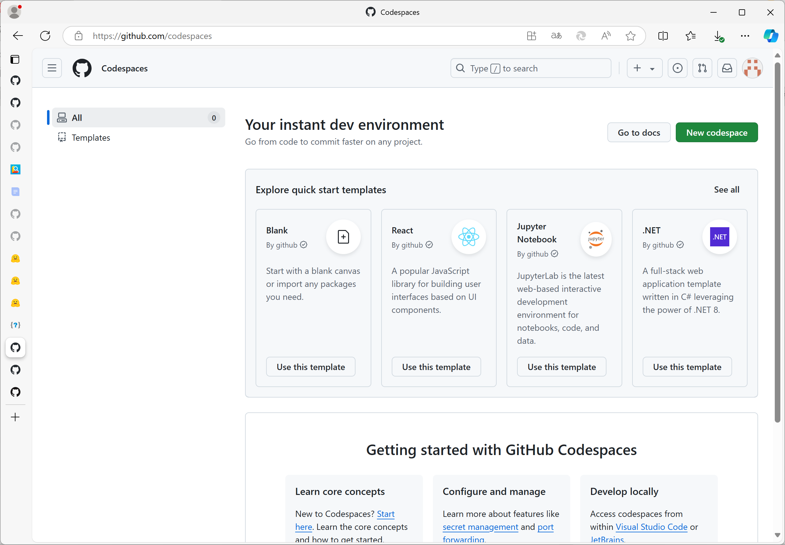
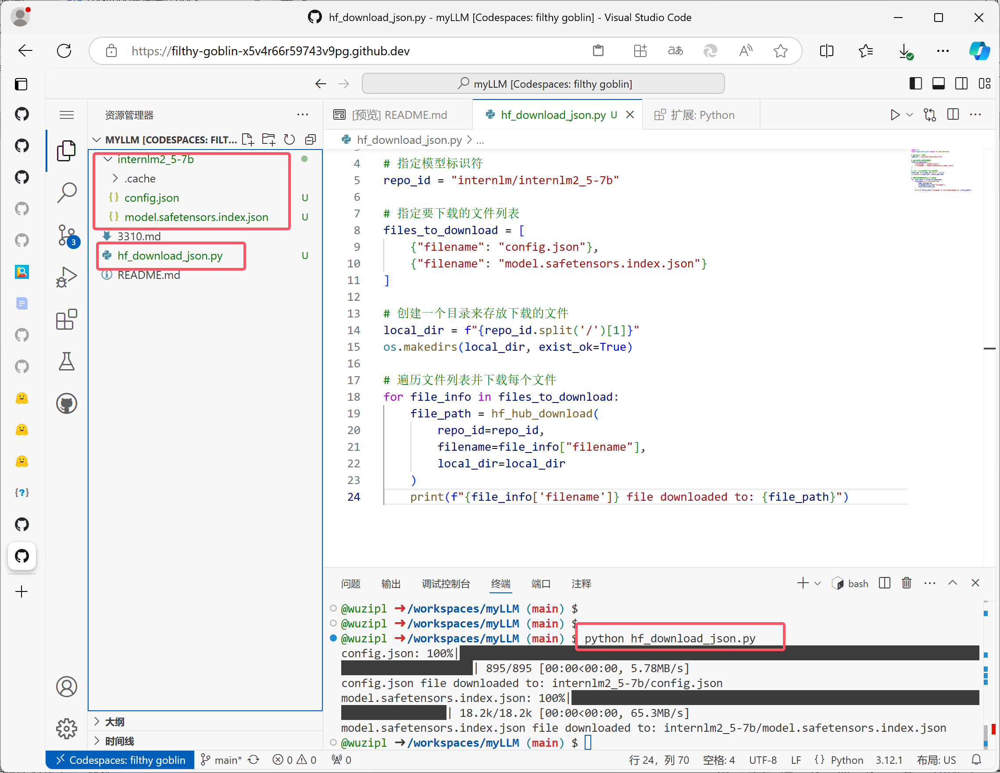
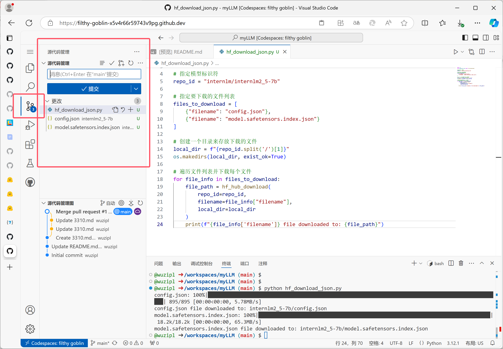
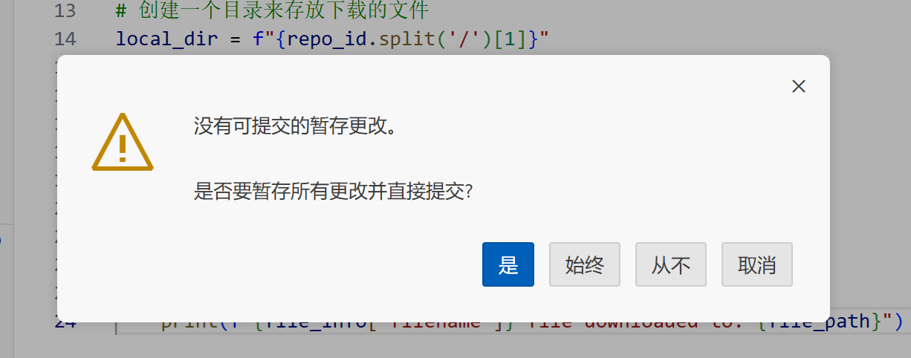
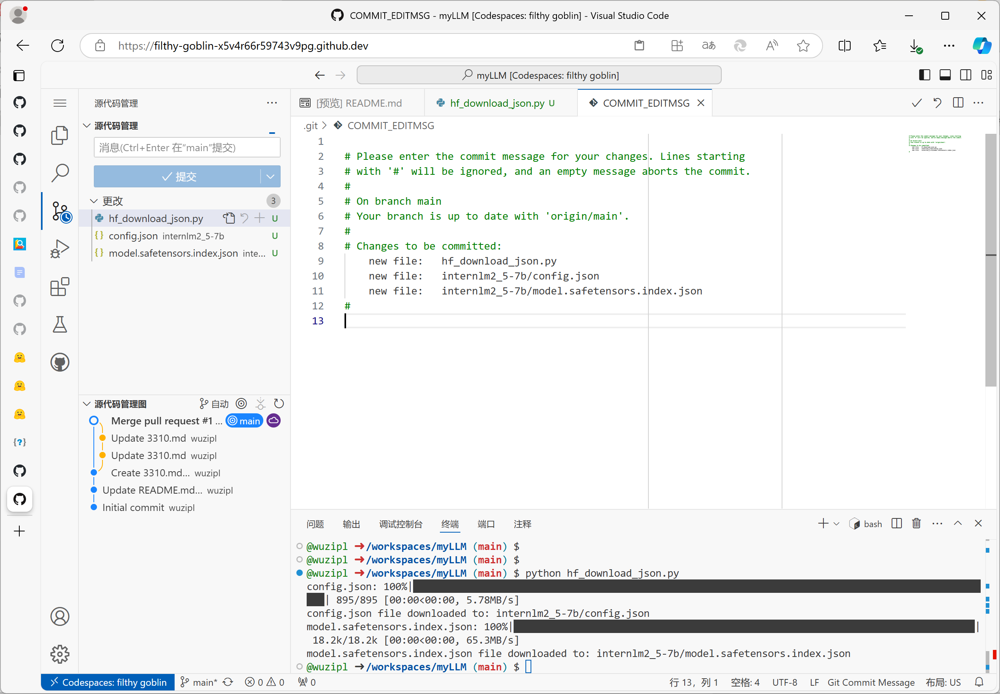
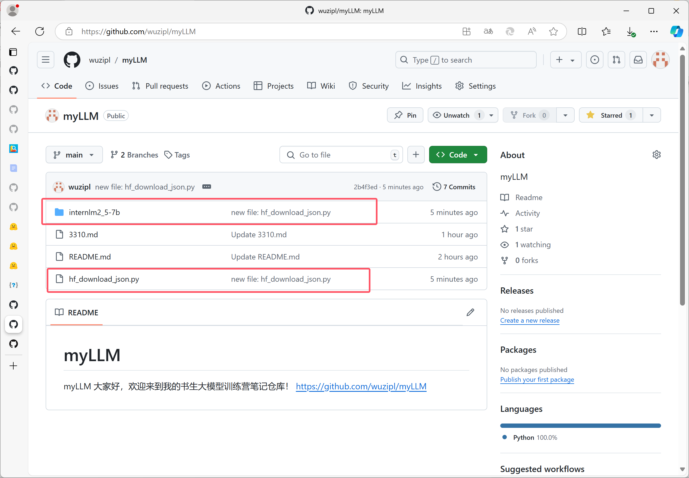
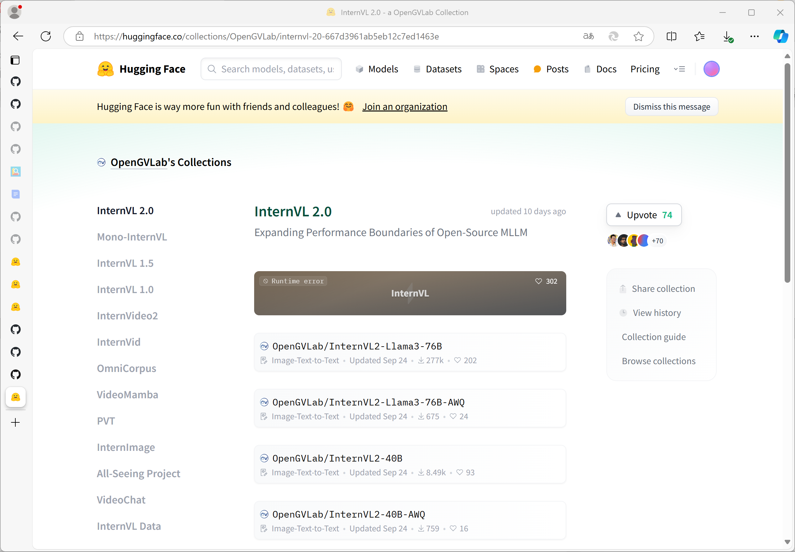
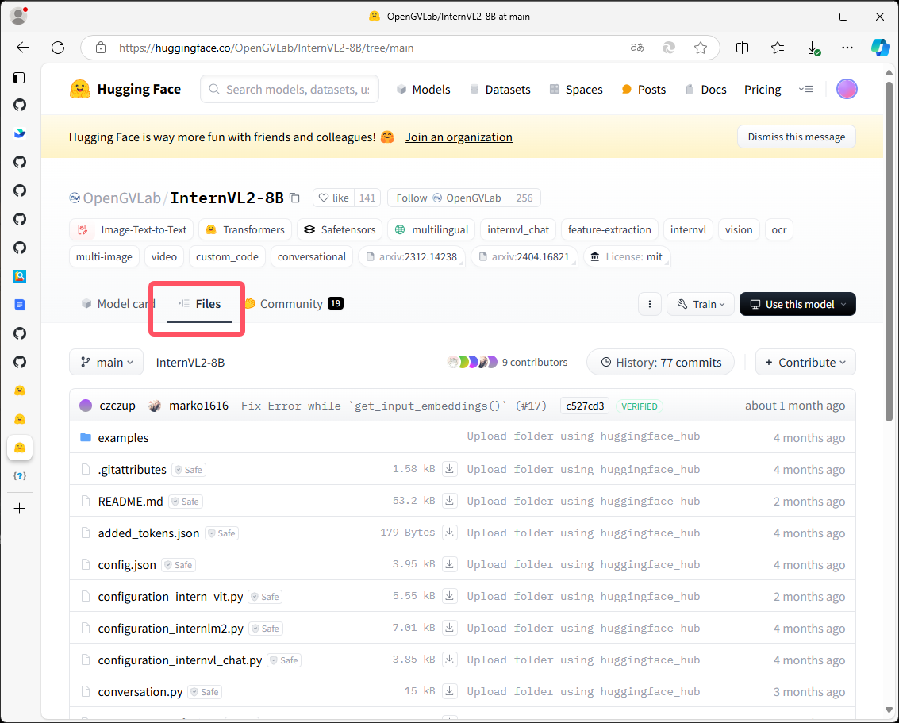
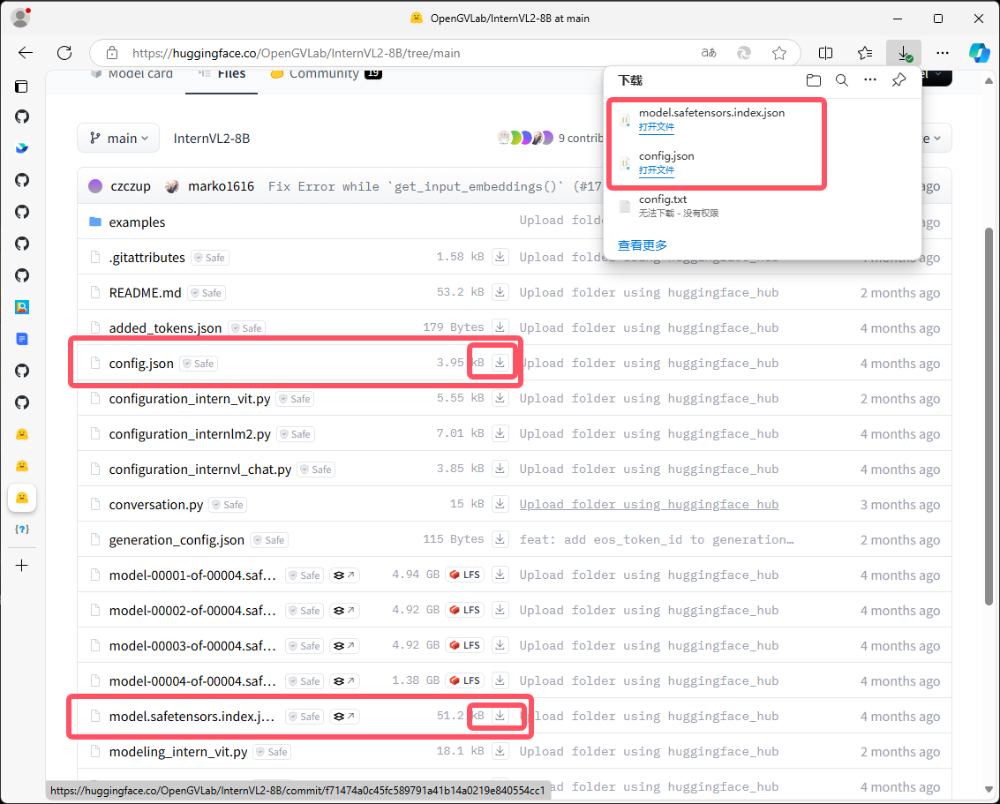

# 书生大模型实战营第4期系列课程——1.4 玩转HF/魔搭/魔乐社区

书生大模型实战营第4期即将在10月底开营。学习和实践在上海人工智能实验室提供的InternStudio开发机在线环境中完成。扫码成功报名参加实战营后，将获得学员ID和一个InternStudio开发机登录用户ID，可以学习一系列的课程并完成相应任务。学习分为4个阶段，每个阶段有2-6个课程和任务。开源链接：https://github.com/InternLM/InternLM。   

   

今天是第一阶段第四个任务，学习在HF（Hugging Face）平台下载文档中提到的模型（config.json文件、model.safetensors.index.json文件）。

## 1.使用GitHub CodeSpace下载HF平台上的模型文件
在前几个任务中，已经在自己的GitHub中建立了项目仓库myLLM，即将下载的模型文件也将保存在这个仓库的main分支里。
https://github.com/codespaces   页面，新建自己的CodeSpace。

      

进入VSCode界面，在终端输入以下代码，安装依赖：

```python
#安装transformers   
pip install transformers==4.38   
pip install sentencepiece==0.1.99   
pip install einops==0.8.0   
pip install protobuf==5.27.2   
pip install accelerate==0.33.0   

```

   


安装完成后，在资源管理器新建文件hf_download_josn.py，粘贴以下代码，并运行。
```python
import os
from huggingface_hub import hf_hub_download

#指定模型标识符
repo_id = "internlm/internlm2_5-7b"

#指定要下载的文件列表
files_to_download = [
    {"filename": "config.json"},
{"filename": "model.safetensors.index.json"}
]

#创建一个目录来存放下载的文件
local_dir = f"{repo_id.split('/')[1]}"
os.makedirs(local_dir, exist_ok=True)

#遍历文件列表并下载每个文件
for file_info in files_to_download:
    file_path = hf_hub_download(
        repo_id=repo_id,
        filename=file_info["filename"],
        local_dir=local_dir
    )
print(f"{file_info['filename']} file downloaded to: {file_path}")

```  
代码执行完毕后，资源管理器会显示已经下载好的模型文件。
点击左边栏“源代码管理器”，提交，暂存并提交更改。

  

  

  

刷新后，GitHub里myLLM仓库main主分支下会显示出刚刚添加的hf_download_josn.py文件和下载的模型文件。

   

## 2.在HF平台直接下载模型文件至本地
打开书生大模型下载地址InternVL 2.0 - a OpenGVLab Collection（https://huggingface.co/collections/OpenGVLab/internvl-20-667d3961ab5eb12c7ed1463e）。



选择要下载的模型，点击进入该模型界面，点击“Files”，出现模型文件列表，点击文件后下载图标，即可下载。






